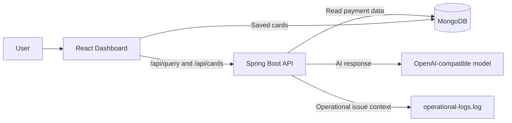
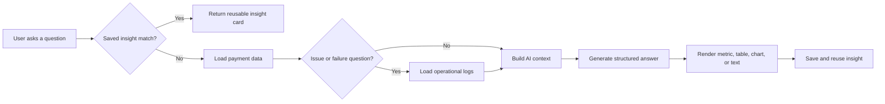

# AI Query Dashboard

A two-part application that turns natural-language questions into reusable dashboard cards over payment and operational data.

## Overview

- Frontend: React + TypeScript + Vite dashboard that renders AI-generated JSON cards, with an expandable Saved insights menu and full-screen card view.
- Backend: Spring Boot service that queries MongoDB, correlates operational logs for issue questions, enforces guardrails, stores saved cards, and calls an AI provider.
- Data layer: sample ISO payments, operational logs, and real-world-style payment records for dashboard testing and demos.

## System flow



## What this project does

- Accepts natural-language queries about payments, failures, risks, and processing issues.
- Uses MongoDB as the source of truth for payment records and saved insight cards.
- Applies guardrails to keep queries within a safe time window and prevents unsupported large-range requests.
- Reuses previously saved cards when the same query is asked again.
- Renders AI responses as text, metrics, tables, and charts.
- Keeps 100 structured file-based operational events for rail, fraud, compliance, processing, database, and integration analysis.

## Demo flow



## Quick start

### 1) Backend

```bash
cd ai-query-backend
mvn spring-boot:run
```

### 2) Frontend

```bash
cd ai-query-dashboard
npm install
npm run dev
```

Open the dashboard at http://localhost:5173.

## Environment variables

The backend reads these values from the environment or defaults in application.properties:

- MONGODB_URI
- MONGODB_DATABASE
- AI_API_KEY
- AI_BASE_URL
- AI_PROVIDER (`anthropic` or `openai`)
- AI_ENDPOINT_PATH
- ANTHROPIC_VERSION
- AI_MODEL
- AI_MAX_TOKENS
- AI_REASONING_EFFORT
- AI_COLLECTION
- AI_SAVED_CARDS_COLLECTION

## Project folders

- ai-query-backend: Spring Boot API and data layer logic.
- ai-query-dashboard: frontend UI and chart rendering.
- ai-query-backend/src/main/resources: sample MongoDB payloads, logs, and fixtures.

## Further reading

- Backend project guide: [ai-query-backend/README.md](ai-query-backend/README.md)
- Frontend project guide: [ai-query-dashboard/README.md](ai-query-dashboard/README.md)

## Notes

This workspace is designed for experimentation and demos, not production-grade deployment by default. The sample payment data and operational logs are structured to support realistic trend, failure, fraud, and exception analysis scenarios.