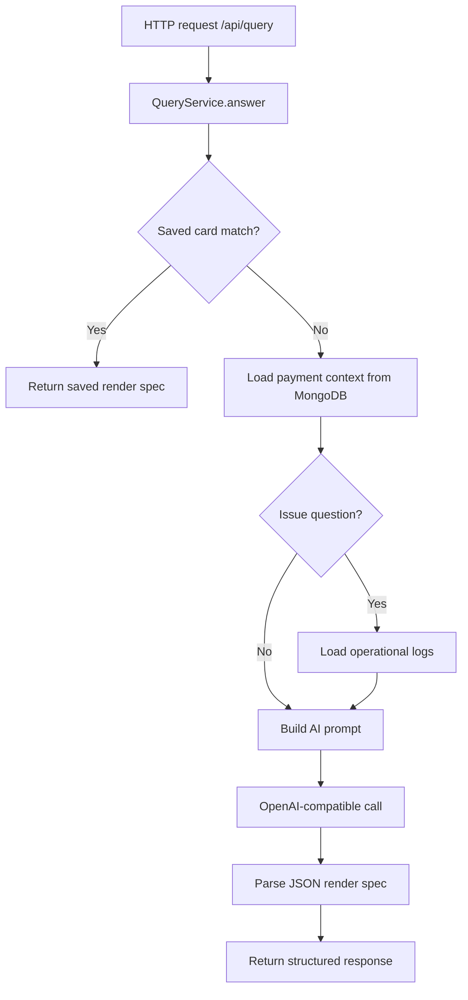
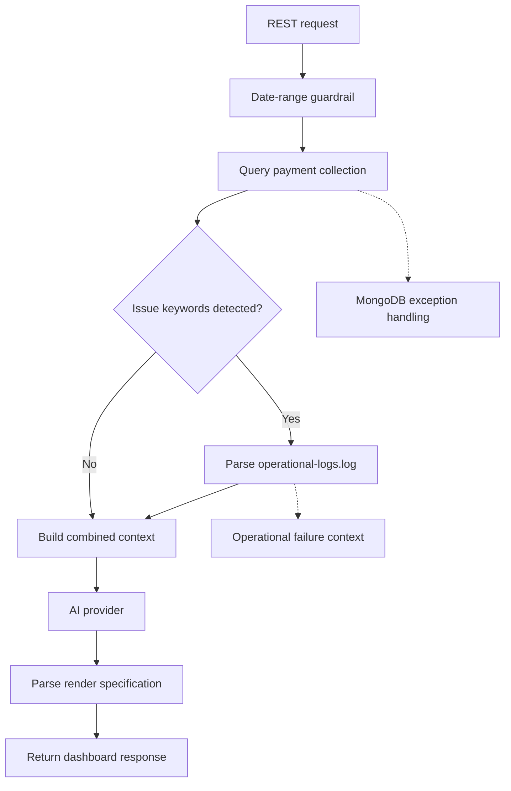

# AI Query Backend

The backend is a Spring Boot service that connects a MongoDB payment dataset with an AI query layer and a lightweight saved-card system.

## Purpose

- Accepts natural-language queries from the React dashboard.
- Loads relevant payment records from MongoDB.
- Includes operational logs for issue-related questions such as failures, fraud, rail errors, and database exceptions.
- Sends a structured prompt to an OpenAI-compatible model.
- Returns a JSON render specification that the UI can render as text, metric, table, or chart.
- Saves and reuses user-created cards by normalized query.

## Core flow



## Key responsibilities

- Guardrails: blocks queries requesting more than one year of data and keeps the default context window to recent records.
- Saved cards: stores card metadata and render specs in MongoDB.
- Runtime collection setup: ensures the configured collections exist automatically.
- Log correlation: reads file-based operational logs when issue/failure questions are asked.
- Repeated-query optimization: returns a saved card if the same normalized query is seen again.
- Structured context: sends payment records and relevant operational events to the AI provider as JSON context.

## Backend context flow



## Main files

- QueryController.java: REST endpoints for query and card operations.
- QueryService.java: core AI orchestration, guardrails, context loading, Mongo logic, and saved-card reuse.
- application.properties: database and model config.

## Run locally

```bash
cd ai-query-backend
mvn spring-boot:run
```

## Build and test

```bash
mvn test
```

```bash
mvn package
```

## Configuration

The service reads the following settings from environment variables or defaults:

- MONGODB_URI
- MONGODB_DATABASE
- AI_API_KEY
- AI_BASE_URL
- AI_PROVIDER (`anthropic` or `openai`)
- AI_ENDPOINT_PATH
- ANTHROPIC_VERSION
- AI_MODEL
- AI_MAX_TOKENS
- AI_REASONING_EFFORT
- AI_COLLECTION
- AI_SAVED_CARDS_COLLECTION

## Data resources

The backend includes sample data under src/main/resources, including:

- payments-mongo-import.json: denormalized payment records for direct Mongo import.
- generic-payment-message.json: ISO-style message structure sample.
- iso20022-sample-messages.json: representative message-type payloads.
- operational-logs.log: 100 pipe-delimited operational events covering payment rails, fraud checks, compliance, processing failures, MongoDB errors, and AI integration failures.

Operational log format:

```text
timestamp|level|service|transactionId|message
```

The message contains searchable key/value fields such as `category`, `rail`, `event`, `status`, `errorCode`, `decision`, and `retryable`.

## API endpoints

- `POST /api/query`: answer a natural-language question.
- `GET /api/cards`: list saved insight cards.
- `POST /api/cards`: create a saved insight card.
- `PUT /api/cards/{id}`: update a saved insight card.
- `DELETE /api/cards/{id}`: remove a saved insight card.

## Notes

This project is built as a demo and sandbox for AI-driven payment analysis. The prompts and matcher logic are intentionally structured to support realistic operational, payment, and compliance investigation scenarios.
