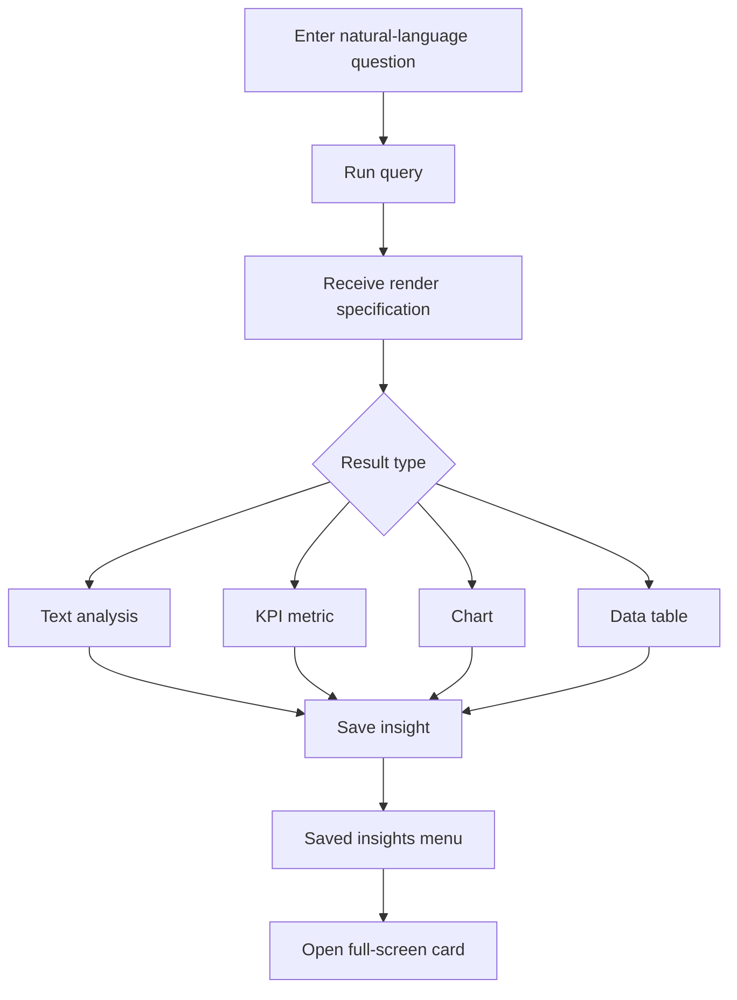

# AI Query Dashboard UI

The frontend is a light-theme React dashboard for asking questions and displaying AI-generated answer cards over payment and operational data.

## What it does

- Sends natural-language prompts to the backend API.
- Displays results as cards with text, metrics, tables, and charts.
- Lets users edit, minimize, delete, and expand cards into a full-screen view.
- Saves cards into MongoDB through the backend API.
- Shows saved cards in an expandable sidebar menu with a live count.
- Shows the full query preview in each card with hover details.
- Supports search and a clean light-theme visual design.

## Dashboard flow



## Tech stack

- React 19
- TypeScript
- Vite
- Tailwind CSS with custom CSS styling
- Recharts for chart rendering
- Lucide icons

## Project structure

```text
src/
  App.tsx        - main UI and card rendering logic
  App.css       - dashboard styling
  main.tsx      - app bootstrap
  index.css     - base global styles
```

## Run locally

```bash
cd ai-query-dashboard
npm install
npm run dev
```

The app is expected to run on:

- http://localhost:5173

The backend API is expected to be running on:

- http://localhost:8080

## Build

```bash
npm run build
```

## API expectations

The front end calls these endpoints on the backend:

- POST /api/query
- GET /api/cards
- POST /api/cards
- PUT /api/cards/{id}
- DELETE /api/cards/{id}

The query response is expected to be a render specification object containing fields like type, title, summary, data, xKey, yKey, and related visual metadata.

## Notes

The dashboard renders generic result payloads rather than hard-coded domain views. It supports text, KPI, table, bar, stacked bar, line, area, pie, scatter, and histogram responses.
